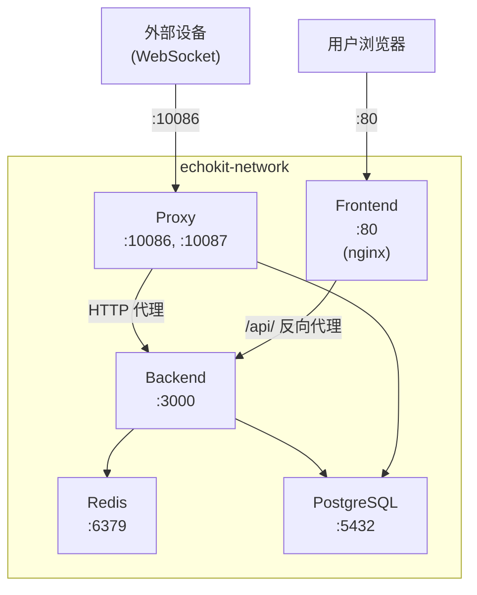

# EchoKit Console Docker Compose 部署指南

- [EchoKit Console Docker Compose 部署指南](#echokit-console-docker-compose-部署指南)
  - [概述](#概述)
  - [前置条件](#前置条件)
  - [服务架构](#服务架构)
  - [快速开始](#快速开始)
    - [1. 克隆项目](#1-克隆项目)
    - [2. 配置环境变量](#2-配置环境变量)
      - [必须修改（生产环境）](#必须修改生产环境)
      - [示例配置](#示例配置)
    - [3. 启动服务](#3-启动服务)
    - [4. 验证部署](#4-验证部署)
    - [5. 初始化数据库（首次部署）](#5-初始化数据库首次部署)
  - [服务端口说明](#服务端口说明)
  - [数据持久化](#数据持久化)
  - [常用操作](#常用操作)
    - [停止服务](#停止服务)
    - [停止并删除数据卷（慎用）](#停止并删除数据卷慎用)
    - [重启单个服务](#重启单个服务)
    - [查看单个服务日志](#查看单个服务日志)
    - [进入容器调试](#进入容器调试)
    - [更新镜像并重新部署](#更新镜像并重新部署)
  - [环境变量配置参考](#环境变量配置参考)
    - [Proxy 服务](#proxy-服务)
    - [Backend 服务](#backend-服务)
  - [故障排查](#故障排查)
    - [服务无法启动](#服务无法启动)
    - [数据库连接失败](#数据库连接失败)
    - [设备无法连接 Proxy](#设备无法连接-proxy)
    - [Redis 连接失败](#redis-连接失败)
  - [生产环境建议](#生产环境建议)

## 概述

本文档介绍如何使用 Docker Compose 部署 EchoKit Console 服务。

## 前置条件

- Docker 20.10+
- Docker Compose 2.0+
- 至少 4GB 可用内存
- 开放端口：80, 3000, 5432, 6379, 10086, 10087

## 服务架构



## 快速开始

### 1. 克隆项目

```bash
git clone <repository-url>
cd echokit-console
```

### 2. 配置环境变量

修改 `docker compose.yml` 中的以下配置项：

#### 必须修改（生产环境）

| 服务 | 环境变量 | 说明 |
|-----|---------|------|
| backend | `JWT_SECRET` | JWT 签名密钥，必须更改为强随机字符串 |
| proxy | `EXTERNAL_HOST` | Proxy 对外访问 IP 地址 |
| proxy | `EXTERNAL_PORT` | Proxy 对外访问端口 |
| backend | `PROXY_EXTERNAL_HOST` | 与 proxy 的 `EXTERNAL_HOST` 保持一致 |
| backend | `PROXY_EXTERNAL_PORT` | 与 proxy 的 `EXTERNAL_PORT` 保持一致 |
| backend | `EXTERNAL_HOST` | Backend 对外访问 IP 地址 |

#### 示例配置

假设服务器 IP 为 `192.168.1.100`：

```yaml
# proxy 服务
EXTERNAL_HOST: 192.168.1.100
EXTERNAL_PORT: 10086

# backend 服务
JWT_SECRET: your-super-secure-random-secret-key-here
PROXY_EXTERNAL_HOST: 192.168.1.100
PROXY_EXTERNAL_PORT: 10086
EXTERNAL_HOST: 192.168.1.100
```

### 3. 启动服务

```bash
# 设置宿主机数据目录（必须使用绝对路径）
export HOST_DATA_DIR="/path/to/echokit-data"

# 创建数据目录
mkdir -p $HOST_DATA_DIR/configs $HOST_DATA_DIR/records

# 构建并启动所有服务（后台运行）
HOST_DATA_DIR=$HOST_DATA_DIR docker compose up -d --build

# 查看服务状态
docker compose ps

# 查看日志
docker compose logs -f
```

> **重要**：`HOST_DATA_DIR` 必须设置为宿主机的绝对路径，用于 Backend 创建 EchoKit Server 容器时挂载配置文件。

### 4. 验证部署

```bash
# 检查服务健康状态
curl http://localhost:3000/health      # Backend
curl http://localhost:10087/health     # Proxy
curl http://localhost:80/health        # Frontend

# 检查数据库连接
docker exec echokit-postgres psql -U echokit -d echokit -c "SELECT 1"

# 检查 Redis 连接
docker exec echokit-redis redis-cli ping
```

### 5. 初始化数据库（首次部署）

数据库迁移脚本会在 PostgreSQL 容器启动时自动执行（通过 `/docker-entrypoint-initdb.d/`）。

如需手动执行（按顺序执行所有迁移脚本）：

```bash
# 执行所有迁移脚本
for f in backend/migrations/*.sql; do
  echo "执行: $f"
  docker exec -i echokit-postgres psql -U echokit -d echokit < "$f"
done

# 或单独执行某个脚本
docker exec -i echokit-postgres psql -U echokit -d echokit < backend/migrations/001_create_devices_table.sql
```

## 服务端口说明

| 端口 | 服务 | 用途 |
|-----|------|------|
| 80 | Frontend | Web 界面 |
| 3000 | Backend | REST API（内部/调试用） |
| 5432 | PostgreSQL | 数据库（内部/调试用） |
| 6379 | Redis | 缓存（内部/调试用） |
| 10086 | Proxy | 设备 WebSocket 连接 |
| 10087 | Proxy | 健康检查 |

## 数据持久化

| 存储类型 | 路径/卷名 | 用途 |
|-----|------|------|
| Docker 卷 | `redis_data` | Redis 持久化数据 |
| Docker 卷 | `postgres_data` | PostgreSQL 数据库文件 |
| Bind Mount | `$HOST_DATA_DIR` | AI 配置、录音文件等 |

查看 Docker 卷：

```bash
docker volume ls | grep echokit
```

查看数据目录：

```bash
ls -la $HOST_DATA_DIR
```

> **注意**：Backend 的数据使用 bind mount 而非 Docker 卷，因为 Backend 需要将配置文件挂载到动态创建的 EchoKit Server 容器中。

## 常用操作

### 停止服务

```bash
docker compose down
```

### 停止并删除数据卷（慎用）

```bash
docker compose down -v
```

### 重启单个服务

```bash
docker compose restart backend
docker compose restart proxy
```

### 查看单个服务日志

```bash
docker compose logs -f backend
docker compose logs -f proxy
```

### 进入容器调试

```bash
docker exec -it echokit-backend /bin/sh
docker exec -it echokit-proxy /bin/sh
docker exec -it echokit-postgres psql -U echokit -d echokit
docker exec -it echokit-redis redis-cli
```

### 更新镜像并重新部署

```bash
docker compose pull
docker compose up -d --build
```

## 环境变量配置参考

### Proxy 服务

| 变量 | 默认值 | 说明 |
|-----|-------|------|
| `DATABASE_URL` | - | PostgreSQL 连接字符串 |
| `DB_POOL_SIZE` | 10 | 数据库连接池大小 |
| `PROXY_PORT` | 10086 | WebSocket + HTTP API 代理端口 |
| `HEALTH_CHECK_PORT` | 10087 | 健康检查端口 |
| `WS_TIMEOUT` | 300 | WebSocket 连接超时（秒） |
| `ECHOKIT_HOST` | localhost | EchoKit Server 容器主机地址 |
| `BACKEND_URL` | - | Backend API 地址 |
| `HTTP_PROXY_TIMEOUT_MS` | 30000 | HTTP 代理请求超时（毫秒） |
| `LOG_LEVEL` | info | 日志级别 |
| `EXTERNAL_HOST` | - | Proxy 对外访问 IP |
| `EXTERNAL_PORT` | 10086 | Proxy 对外访问端口 |

### Backend 服务

| 变量 | 默认值 | 说明 |
|-----|-------|------|
| `SERVER_ADDR` | 0.0.0.0 | 监听地址 |
| `SERVER_PORT` | 3000 | 服务端口 |
| `DATABASE_URL` | - | PostgreSQL 连接字符串 |
| `REDIS_URL` | - | Redis 连接地址 |
| `ACTIVATION_TTL_SECONDS` | 300 | 激活码有效期（秒） |
| `JWT_SECRET` | - | JWT 签名密钥（必须更改） |
| `PROXY_EXTERNAL_HOST` | localhost | Proxy 对外访问 IP |
| `PROXY_EXTERNAL_PORT` | 10086 | Proxy 对外访问端口 |
| `DOCKER_IMAGE` | - | EchoKit Server 镜像 |
| `CONFIG_DIR` | /app/data/configs | AI 配置文件目录（容器内路径） |
| `RECORD_DIR` | /app/data/records | 录音文件目录（容器内路径） |
| `HELLO_WAV_PATH` | /app/data/hello.wav | 欢迎语音文件（可选） |
| `HOST_DATA_DIR` | - | 宿主机数据目录（**必须设置为绝对路径**） |
| `PORT_RANGE_START` | 8080 | 容器端口范围起始 |
| `PORT_RANGE_END` | 8180 | 容器端口范围结束 |
| `EXTERNAL_HOST` | - | Backend 对外访问 IP |
| `HEALTH_CHECK_HOST` | localhost | 健康检查主机（Docker 部署时使用 host.docker.internal） |

## 故障排查

### 服务无法启动

```bash
# 查看详细日志
docker compose logs backend
docker compose logs proxy

# 检查容器状态
docker compose ps -a
```

### 数据库连接失败

```bash
# 检查 PostgreSQL 是否启动
docker compose ps postgres

# 检查网络连通性
docker exec echokit-backend ping postgres
```

### 设备无法连接 Proxy

1. 检查 `EXTERNAL_HOST` 是否正确配置为服务器 IP
2. 检查防火墙是否开放 10086 端口
3. 检查设备配网时填写的服务器地址是否正确

### Redis 连接失败

```bash
# 检查 Redis 是否启动
docker compose ps redis

# 检查 Redis 健康状态
docker exec echokit-redis redis-cli ping
```

## 生产环境建议

1. **安全配置**
   - 更改所有默认密码（PostgreSQL、Redis）
   - 使用强随机字符串作为 `JWT_SECRET`
   - 限制数据库端口仅内部访问

2. **性能优化**
   - 根据负载调整 `DB_POOL_SIZE`
   - 配置适当的 `WS_TIMEOUT`

3. **监控告警**
   - 配置健康检查监控
   - 设置日志收集和告警

4. **备份策略**
   - 定期备份 PostgreSQL 数据
   - 备份 `$HOST_DATA_DIR` 目录中的配置文件

5. **HTTPS 配置**
   - 在 Frontend nginx 前添加反向代理
   - 配置 SSL 证书
